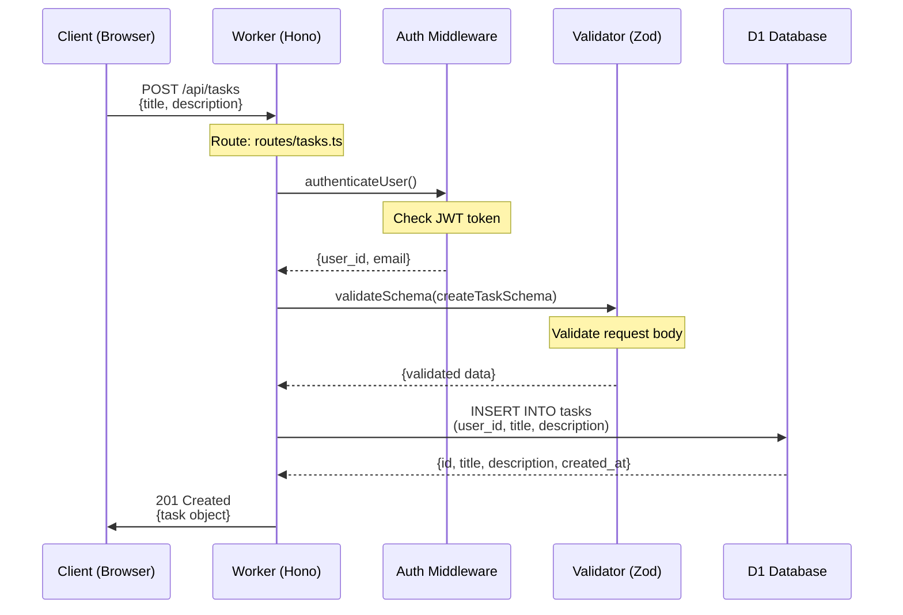
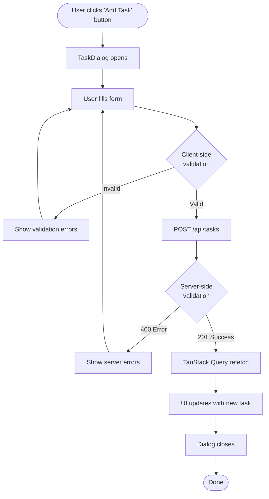
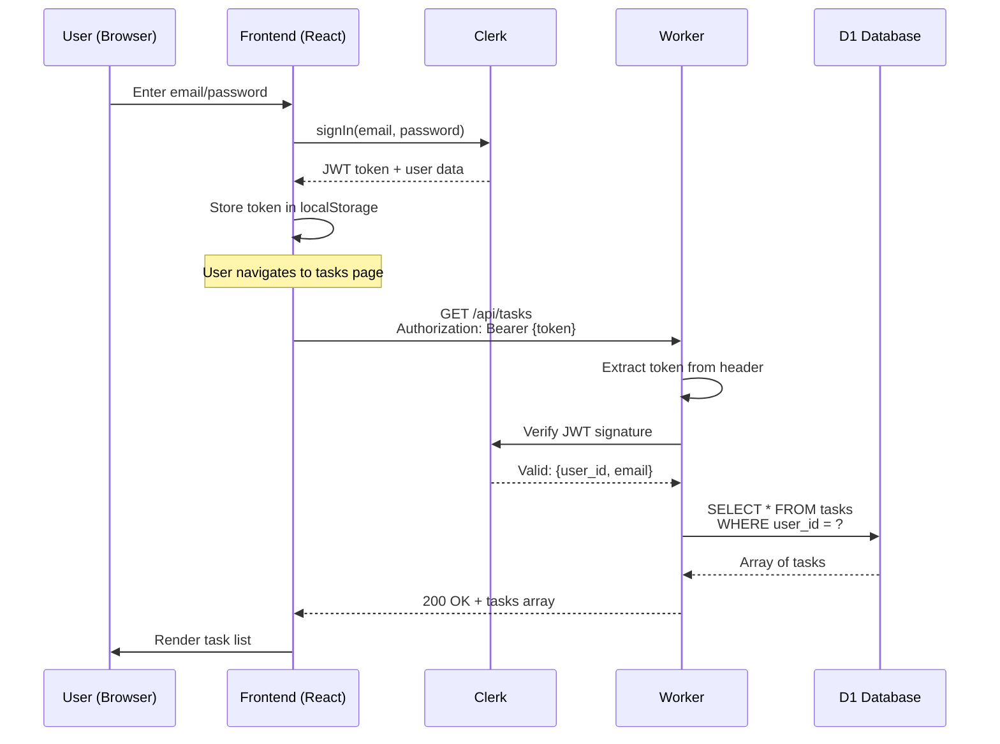
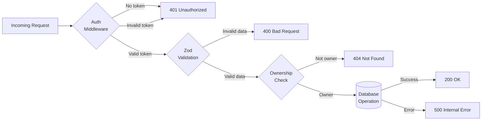
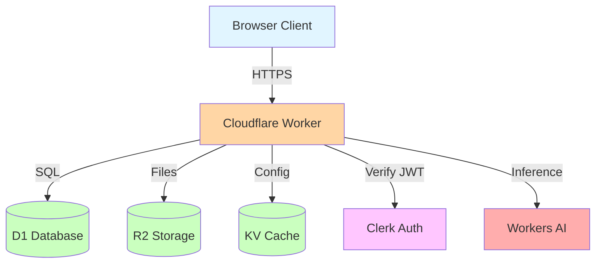
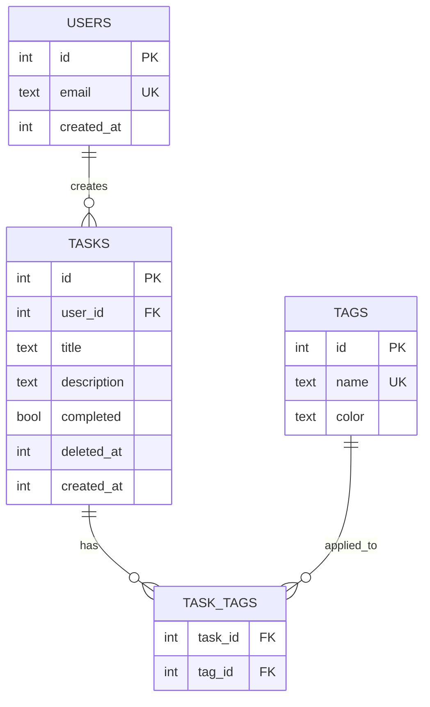

# Example: Enhanced Phase with File-Level Detail

This document shows before/after examples of phases with and without file-level detail enhancements.

---

## Example Project: Task Management API

A simple task management system with user authentication, CRUD operations, and tagging.

---

## BEFORE: Basic Phase (Without File-Level Detail)

```markdown
## Phase 3: Tasks API

**Type**: API
**Estimated**: 4 hours (~4 minutes human time)
**Files**: `src/routes/tasks.ts`, `src/lib/schemas.ts`, `src/middleware/auth.ts`

### Tasks
- [ ] Create task validation schemas
- [ ] Implement GET /api/tasks endpoint
- [ ] Implement POST /api/tasks endpoint
- [ ] Implement PATCH /api/tasks/:id endpoint
- [ ] Implement DELETE /api/tasks/:id endpoint
- [ ] Add error handling
- [ ] Test all endpoints

### Verification Criteria
- [ ] All endpoints return correct status codes
- [ ] Validation works properly
- [ ] Authentication is enforced
- [ ] CRUD operations work

### Exit Criteria
Task API is complete and functional.
```

**Problems with basic phase**:
- ❌ Claude doesn't know file relationships (what imports what)
- ❌ No indication of which file to start with
- ❌ Missing security considerations (ownership checks)
- ❌ No performance considerations (pagination)
- ❌ Vague verification criteria
- ❌ Token waste: Claude will grep/glob to understand structure

---

## AFTER: Enhanced Phase (With File-Level Detail)

```markdown
## Phase 3: Tasks API

**Type**: API
**Estimated**: 4 hours (~4 minutes human time)
**Files**: `src/routes/tasks.ts` (new), `src/lib/schemas.ts` (modify), `src/middleware/auth.ts` (existing)

### File Map

- `src/routes/tasks.ts` (estimated ~150 lines)
  - **Purpose**: CRUD endpoints for task management
  - **Key exports**: GET, POST, PATCH, DELETE handlers
  - **Dependencies**:
    - `../lib/schemas` (taskSchema, createTaskSchema, updateTaskSchema)
    - `../middleware/auth` (authenticateUser middleware)
    - `env.DB` (D1 binding)
  - **Used by**: Main Hono app (src/index.ts)
  - **Route**: `/api/tasks` and `/api/tasks/:id`

- `src/lib/schemas.ts` (add ~40 lines to existing)
  - **Purpose**: Zod validation schemas for request/response validation
  - **Key exports**:
    - `taskSchema` - Complete task object
    - `createTaskSchema` - New task input validation
    - `updateTaskSchema` - Partial task updates
  - **Dependencies**: `zod` package
  - **Used by**: routes/tasks.ts (validation), frontend forms (type inference)
  - **Modifications**: Add three new schema definitions to existing file

- `src/middleware/auth.ts` (existing, no changes needed)
  - **Purpose**: JWT verification and user extraction
  - **Key exports**: `authenticateUser` middleware
  - **Note**: Already implemented in Phase 2, just import and use

### Data Flow



### Critical Dependencies

**Internal** (codebase files):
- `src/middleware/auth.ts` - JWT authentication (must run before routes)
- `src/lib/schemas.ts` - Validation schemas (import and extend)
- `src/index.ts` - Main Hono app (register routes here)

**External** (npm packages):
- `zod` (^3.23.8) - Schema validation
- `hono` (^4.6.14) - Web framework
- `@clerk/backend` (^1.18.5) - JWT verification

**Configuration** (environment):
- `CLERK_SECRET_KEY` - Set in wrangler.jsonc secrets
- No additional env vars needed

**Cloudflare Bindings**:
- `DB` (D1 database) - Must be configured in wrangler.jsonc:
  ```jsonc
  {
    "d1_databases": [
      {
        "binding": "DB",
        "database_name": "task-manager-db",
        "database_id": "your-database-id"
      }
    ]
  }
  ```

### Gotchas & Known Issues

**🔒 Security: Ownership Verification Required**:
- PATCH and DELETE **must** verify `task.user_id === user.id` before mutations
- Failing to check allows users to modify/delete others' tasks (critical security vulnerability)
- Pattern:
  ```typescript
  // Fetch task first
  const task = await env.DB.prepare('SELECT * FROM tasks WHERE id = ?').bind(id).first();
  if (!task || task.user_id !== user.id) {
    return c.json({ error: 'Not found or unauthorized' }, 404);
  }
  // Now safe to update/delete
  ```

**⚡ Performance: Pagination Required for GET**:
- Without pagination, endpoint returns ALL tasks (performance issue for users with 1000+ tasks)
- Max: 50 tasks per page (reasonable default)
- Use query params: `?page=1&limit=50`
- Pattern:
  ```typescript
  const page = parseInt(c.req.query('page') || '1');
  const limit = Math.min(parseInt(c.req.query('limit') || '50'), 100); // Cap at 100
  const offset = (page - 1) * limit;

  const tasks = await env.DB.prepare(
    'SELECT * FROM tasks WHERE user_id = ? AND deleted_at IS NULL ORDER BY created_at DESC LIMIT ? OFFSET ?'
  ).bind(user.id, limit, offset).all();
  ```

**🗑️ Data Integrity: Soft Delete Pattern**:
- Don't use `DELETE FROM tasks` (hard delete loses data permanently)
- Use `UPDATE tasks SET deleted_at = ? WHERE id = ?` (soft delete)
- Reasons:
  - Audit trail (know when/why data was deleted)
  - Undo capability (restore deleted tasks)
  - Data recovery (prevent accidental data loss)
- Filter in queries: `WHERE deleted_at IS NULL`

**🕐 Timezone Handling**:
- Store all timestamps as UTC unix timestamps (INTEGER)
- Convert to user's timezone in frontend only
- Patterns:
  - Storage: `Math.floor(Date.now() / 1000)` (unix timestamp in seconds)
  - Display: `new Date(timestamp * 1000).toLocaleString()`
- SQLite date functions won't work with unix timestamps - use JavaScript

**🔍 Case-Sensitive Search**:
- SQLite's LIKE is case-insensitive by default
- For case-sensitive search, use: `WHERE title LIKE ? COLLATE NOCASE`
- For full-text search, consider adding FTS5 table (separate phase)

### Tasks

- [ ] Add task schemas to `src/lib/schemas.ts`
  - [ ] `taskSchema` (base schema)
  - [ ] `createTaskSchema` (omit id, user_id, timestamps)
  - [ ] `updateTaskSchema` (partial with only title, description, completed)

- [ ] Create `src/routes/tasks.ts` file
  - [ ] Set up Hono router with auth middleware
  - [ ] Implement GET /api/tasks (with pagination)
  - [ ] Implement POST /api/tasks (with validation)
  - [ ] Implement PATCH /api/tasks/:id (with ownership check)
  - [ ] Implement DELETE /api/tasks/:id (soft delete with ownership check)

- [ ] Register task routes in `src/index.ts`
  - [ ] Import task routes
  - [ ] Mount at `/api/tasks`

- [ ] Error handling
  - [ ] 400 for validation errors (Zod messages)
  - [ ] 401 for missing/invalid JWT
  - [ ] 404 for non-existent task IDs
  - [ ] 403 for ownership violations

- [ ] Testing (all endpoints with curl or Postman)
  - [ ] Test with valid JWT
  - [ ] Test with invalid/missing JWT
  - [ ] Test with invalid data
  - [ ] Test pagination parameters
  - [ ] Test ownership checks

### Verification Criteria

**Authentication**:
- [ ] Requests without JWT return 401 Unauthorized
- [ ] Requests with invalid JWT return 401 Unauthorized
- [ ] Requests with valid JWT proceed to handler

**GET /api/tasks** (List):
- [ ] Returns 200 with array of user's tasks (only their tasks)
- [ ] Returns empty array `[]` for users with no tasks
- [ ] Pagination works: `?page=2` returns correct offset
- [ ] Limit works: `?limit=10` returns max 10 tasks
- [ ] Deleted tasks are excluded (WHERE deleted_at IS NULL)
- [ ] Tasks are sorted by created_at DESC (newest first)

**POST /api/tasks** (Create):
- [ ] Valid data returns 201 Created with task object
- [ ] Task has auto-generated `id` (integer)
- [ ] Task has `user_id` matching authenticated user
- [ ] Task has `created_at` timestamp
- [ ] Invalid data returns 400 with Zod error messages
- [ ] Missing required fields (title) returns 400

**PATCH /api/tasks/:id** (Update):
- [ ] Valid update returns 200 with updated task
- [ ] Can update `title`, `description`, `completed` fields
- [ ] Cannot update `id`, `user_id`, `created_at` (immutable)
- [ ] Invalid task ID returns 404
- [ ] Another user's task returns 404 (not 403 to avoid leaking existence)
- [ ] Deleted task returns 404

**DELETE /api/tasks/:id** (Soft Delete):
- [ ] Valid delete returns 204 No Content
- [ ] Task still exists in database (SELECT * FROM tasks WHERE id = ?)
- [ ] Task has `deleted_at` timestamp set
- [ ] Task no longer appears in GET /api/tasks
- [ ] Deleting same task twice returns 404 (already deleted)
- [ ] Another user's task returns 404

**Performance**:
- [ ] GET /api/tasks with 100+ tasks completes in <200ms
- [ ] Pagination limits result set (never returns unbounded data)

### Exit Criteria

All CRUD operations work correctly with:
- ✅ Proper HTTP status codes (200, 201, 204, 400, 401, 404)
- ✅ Request validation via Zod schemas
- ✅ Authentication enforcement (JWT required)
- ✅ Ownership checks (users can only access their tasks)
- ✅ Pagination (prevents performance issues)
- ✅ Soft delete (preserves data and audit trail)
- ✅ Error messages are helpful and consistent
```

**Benefits of enhanced phase**:
- ✅ Claude knows exactly where to start (routes/tasks.ts)
- ✅ Clear dependency graph (what imports what)
- ✅ Visual data flow (Mermaid diagram shows request/response)
- ✅ Security considerations upfront (ownership checks)
- ✅ Performance patterns documented (pagination)
- ✅ Specific verification criteria (testable, measurable)
- ✅ Token savings: ~60-70% reduction (fewer grep/glob operations)

---

## More Mermaid Diagram Examples

### Example 1: UI Component Interaction (Flowchart)



### Example 2: Authentication Flow (Sequence Diagram)



### Example 3: Error Handling Paths (Flowchart)



### Example 4: Multi-Service Architecture (Graph)



### Example 5: Database Relationships (ER Diagram)



---

## When to Use Each Diagram Type

| Diagram Type | Best For | Example Use Cases |
|--------------|----------|-------------------|
| **Sequence** | Request/response flows, API calls | Authentication, webhooks, multi-step processes |
| **Flowchart** | Decision logic, user flows | Form validation, error handling, component state |
| **Graph/Architecture** | System components, service boundaries | Multi-service apps, microservices, infrastructure |
| **ER Diagram** | Database relationships | Schema design, data modeling |

---

## Token Efficiency Comparison

### Scenario: "Implement task CRUD endpoints"

**Without file-level detail**:
```
1. Claude greps for existing routes: ~2k tokens
2. Claude globs for schema patterns: ~1k tokens
3. Claude reads 3-4 files to understand structure: ~6k tokens
4. Claude writes code in wrong location: ~2k tokens
5. User corrects: "Use routes/tasks.ts": ~500 tokens
6. Claude re-reads and rewrites: ~4k tokens
Total: ~15.5k tokens, 2 corrections needed
```

**With file-level detail**:
```
1. Claude reads IMPLEMENTATION_PHASES.md file map: ~1k tokens
2. Claude writes code in correct location first try: ~2k tokens
3. Claude references gotchas to implement security checks: ~500 tokens
Total: ~3.5k tokens, 0 corrections needed
```

**Savings**: 12k tokens (~77% reduction) + 2 fewer correction cycles

---

## Summary

Enhanced phases with file-level detail provide:

1. **Navigation efficiency** - Claude knows exactly where to look
2. **Security by default** - Gotchas prevent common vulnerabilities
3. **Performance patterns** - Best practices documented upfront
4. **Visual clarity** - Mermaid diagrams show complex flows
5. **Token savings** - 60-70% reduction vs grep/glob exploration
6. **First-try accuracy** - Correct file placement, fewer rewrites

The small upfront investment in detailed planning (~5 extra minutes) saves significant implementation time and prevents errors.
