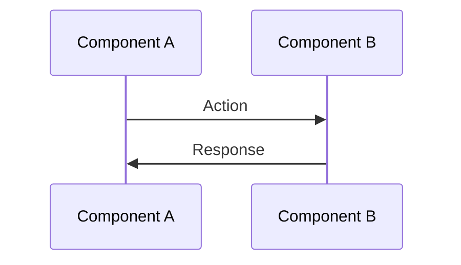

# Implementation Phases: [Project Name]

**Project Type**: [Web App / Dashboard / API / Tool / etc]
**Stack**: Cloudflare Workers + Vite + React + Tailwind v4 + shadcn/ui + D1
**Estimated Total**: [X hours] (~[Y minutes] human time with AI assistance)
**Created**: [Date]

---

## Overview

This document breaks down the project into context-safe phases. Each phase:
- Can be completed in one 2-4 hour session
- Includes built-in verification criteria
- Has clear exit criteria
- Touches 5-8 files maximum
- Requires minimal context from other phases

---

## Phase 1: [Name - Usually "Project Setup"]
**Type**: Infrastructure
**Estimated**: 2-3 hours (~2-3 minutes human time)
**Files**: `package.json`, `wrangler.jsonc`, `vite.config.ts`, `src/index.ts`, `src/index.css`

### Tasks
- [ ] Scaffold Cloudflare Worker with Vite
- [ ] Install dependencies (React, Tailwind v4, shadcn/ui, etc)
- [ ] Configure `wrangler.jsonc` with bindings
- [ ] Setup Tailwind v4 with `@tailwindcss/vite` plugin
- [ ] Initialize shadcn/ui with dark mode support
- [ ] Create basic "Hello World" component
- [ ] Test local dev server
- [ ] Test deployment to Cloudflare

### Verification Criteria
- [ ] `npm run dev` starts without errors
- [ ] `localhost:5173` shows React app with Tailwind styling
- [ ] Dark/light mode toggle works
- [ ] `npm run build` succeeds
- [ ] `npx wrangler deploy` deploys successfully
- [ ] Deployed URL shows working app

### Exit Criteria
Working development environment with successful test deployment. Can iterate on code locally and deploy to Cloudflare.

---

## Phase 2: [Name - Usually "Database Schema" or next major component]
**Type**: [Database/API/UI/Integration]
**Estimated**: [X hours]
**Files**: [List specific files]

### File Map
[Optional but recommended for API/UI/Integration phases]

- `src/[file-name].ts` (estimated ~XXX lines)
  - **Purpose**: [What this file does]
  - **Key exports**: [Main functions/components/types]
  - **Dependencies**: [What it imports]
  - **Used by**: [What uses it]

- `src/[another-file].ts` (modify existing)
  - **Purpose**: [What this file does]
  - **Modifications**: [What changes to make]

### Data Flow
[Optional - Use Mermaid diagram for complex interactions]

### Critical Dependencies

**Internal**: [List codebase files this phase depends on]
**External**: [List npm packages needed]
**Configuration**: [Environment variables, config files]
**Bindings**: [Cloudflare bindings needed: D1, R2, KV, etc]

### Gotchas & Known Issues
[Optional but valuable - Document non-obvious behavior]

- **[Issue name]**: [Description and pattern/solution]
- **[Another issue]**: [Description and pattern/solution]

### Tasks
- [ ] [Specific task 1]
- [ ] [Specific task 2]
- [ ] [Specific task 3]
- [ ] Test basic functionality

### Verification Criteria
- [ ] [Specific test 1]
- [ ] [Specific test 2]
- [ ] [Specific test 3]

### Exit Criteria
[Clear definition of when this phase is complete]

---

## Phase 3: [Name]
**Type**: [Database/API/UI/Integration]
**Estimated**: [X hours]
**Files**: [List specific files]

### File Map
[Include for API/UI/Integration phases]

### Data Flow
[Include Mermaid diagram if helpful]

### Critical Dependencies
**Internal**: | **External**: | **Configuration**: | **Bindings**:

### Gotchas & Known Issues
[Document non-obvious behavior]

### Tasks
- [ ] [Tasks...]

### Verification Criteria
- [ ] [Tests...]

### Exit Criteria
[Definition of done]

---

## Phase 4: [Name]
**Type**: [Database/API/UI/Integration]
**Estimated**: [X hours]
**Files**: [List specific files]

### File Map
[Include for API/UI/Integration phases]

### Data Flow
[Include Mermaid diagram if helpful]

### Critical Dependencies
**Internal**: | **External**: | **Configuration**: | **Bindings**:

### Gotchas & Known Issues
[Document non-obvious behavior]

### Tasks
- [ ] [Tasks...]

### Verification Criteria
- [ ] [Tests...]

### Exit Criteria
[Definition of done]

---

## Phase 5: [Name - Optional: Testing/Polish/Deployment]
**Type**: [Testing/Integration]
**Estimated**: [X hours]
**Files**: [List specific files]

### Tasks
- [ ] [Tasks...]

### Verification Criteria
- [ ] [Tests...]

### Exit Criteria
[Definition of done]

---

## Notes

### Testing Strategy
[Describe when/how testing happens]
- Option A: Testing built into each phase (verification criteria)
- Option B: Separate testing phase at end
- Option C: Hybrid - smoke tests per phase, comprehensive tests at end

### Deployment Strategy
[Describe deployment approach]
- Option A: Deploy after each phase (continuous deployment)
- Option B: Deploy at milestones (after groups of phases)
- Option C: Deploy at end (single production push)

### Context Management
Phases are sized to fit within a single session including:
- Implementation time
- Verification time
- Expected debugging/fixes time
- Documentation updates

If a phase can't be completed in one session, it should be split into sub-phases (e.g., Phase 3.1, Phase 3.2).

### Dependencies
Phases are ordered to minimize dependencies:
1. Infrastructure (no dependencies)
2. Database (depends on Infrastructure)
3. API (depends on Infrastructure + Database)
4. UI (depends on API)
5. Integration (depends on relevant phases)
6. Testing (depends on all implementation phases)

### Known Risks
[Optional: List any known challenges or uncertainties]
- Risk 1: [Description and mitigation]
- Risk 2: [Description and mitigation]

---

## Success Metrics

**Phase Completion**: All verification criteria met, exit criteria satisfied
**Session Handoff**: SESSION.md updated, git checkpoint created
**Overall Success**: [Define what "done" means for this project]

---

## Revision History

**v1.0** ([Date]): Initial phase breakdown
**v1.1** ([Date]): [Changes made]
